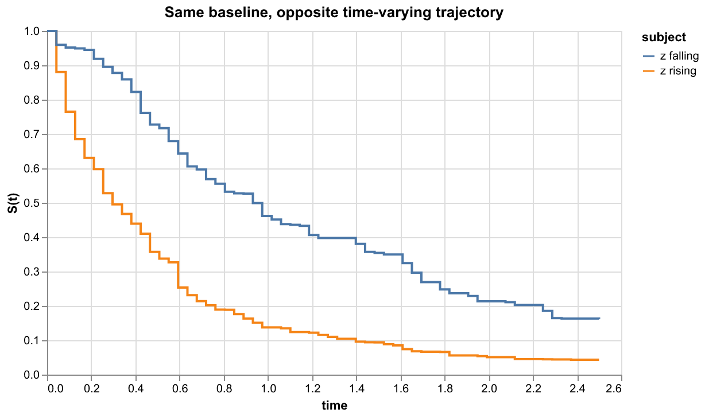
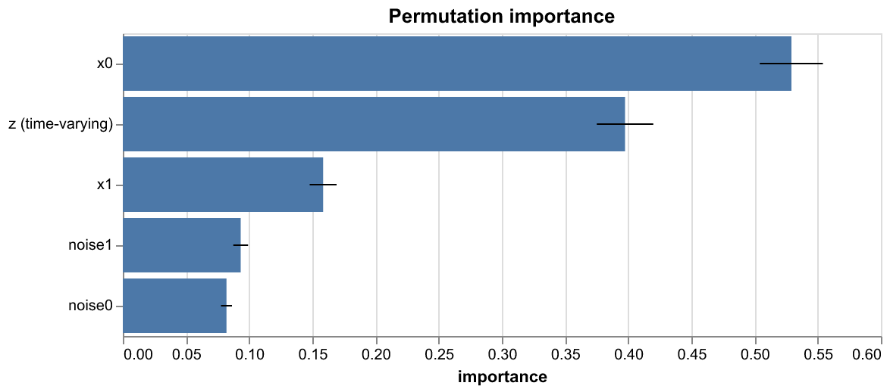

# rftvc

[](https://github.com/ciflikli/rftvc/actions/workflows/ci.yml)
[](https://github.com/ciflikli/rftvc/blob/main/.github/workflows/ci.yml)
[](https://pypi.org/project/rftvc/)
[](https://pypi.org/project/rftvc/)
[](https://rftvc.readthedocs.io/en/latest/)
[](LICENSE)

Random survival forests for **time-varying covariates**, with a Rust engine and a
scikit-learn compatible Python API.

<p align="center">
  
  
</p>

- Counting-process data `(id, start, stop, event, X)` with delayed entry
  (left truncation) and covariates that change over follow-up.
- `SurvivalForestTV`, `CompetingRisksForestTV` (cause-specific hazards, Aalen–Johansen
  CIF), and `Landmark{Survival,CompetingRisks}Forest` for dynamic prediction from a
  rolling landmark time.
- Inspection suite: permutation and drop-column importance (with bootstrap SE),
  leave-one-covariate-out, `hazard_effect` and `path_effect` partial-effect curves.
- Whole-subject resampling, id-level out-of-bag estimates, and leaf sizes
  counted in subjects, not rows.
- Time-aware cross-validation and IPCW landmark metrics.
- An exact log-rank split criterion, and an opt-in coarse time grid for large data.
- Native missing-value splits: trees learn where to route NaN features, including
  splits on missingness itself. `rftvc.impute.impute_locf` offers per-subject
  last-observation-carried-forward preprocessing for time-varying features.
- String and categorical columns in `X` are encoded at fit and reused at prediction.
  Unseen labels raise an error.
- Optional plotting (`rftvc.viz`, `pip install rftvc[viz]`): survival/hazard/CIF curves,
  importance and calibration charts (Altair), and a dependency-free SVG tree diagram.

## Install

```console
pip install rftvc
```

Add the `viz` extra (`pip install rftvc[viz]`) for `rftvc.viz`'s Altair-based charts;
its SVG tree diagram (`rftvc.viz.plot_tree`) needs no extra install.

### From source

A [Rust toolchain](https://rustup.rs/) (via [maturin](https://www.maturin.rs/)) and
[uv](https://docs.astral.sh/uv/) are required.

```console
git clone https://github.com/ciflikli/rftvc.git
cd rftvc
uv venv
uv pip install -e . --group dev
```

## Quickstart

```python
import numpy as np
from rftvc import SurvivalForestTV, make_survival_y

rng = np.random.default_rng(0)
X = rng.normal(size=(200, 3))
t = rng.exponential(np.exp(-0.5 * X[:, 0]))
event = t <= 2.0
y = make_survival_y(np.minimum(t, 2.0), event)

forest = SurvivalForestTV(n_estimators=200, random_state=0).fit(X, y)
risk = forest.predict_risk(X[:5], horizon=1.0)
```

## Documentation

- [Documentation](https://rftvc.readthedocs.io/en/latest/) — user guide, API reference, case studies.
- [Case studies](https://rftvc.readthedocs.io/en/latest/case_studies/index.html) — worked examples on real datasets.
- [Compatibility](https://rftvc.readthedocs.io/en/latest/compatibility.html) — supported
  Python, scikit-learn and platform versions.
- [Changelog](CHANGELOG.md)

## License

MIT
